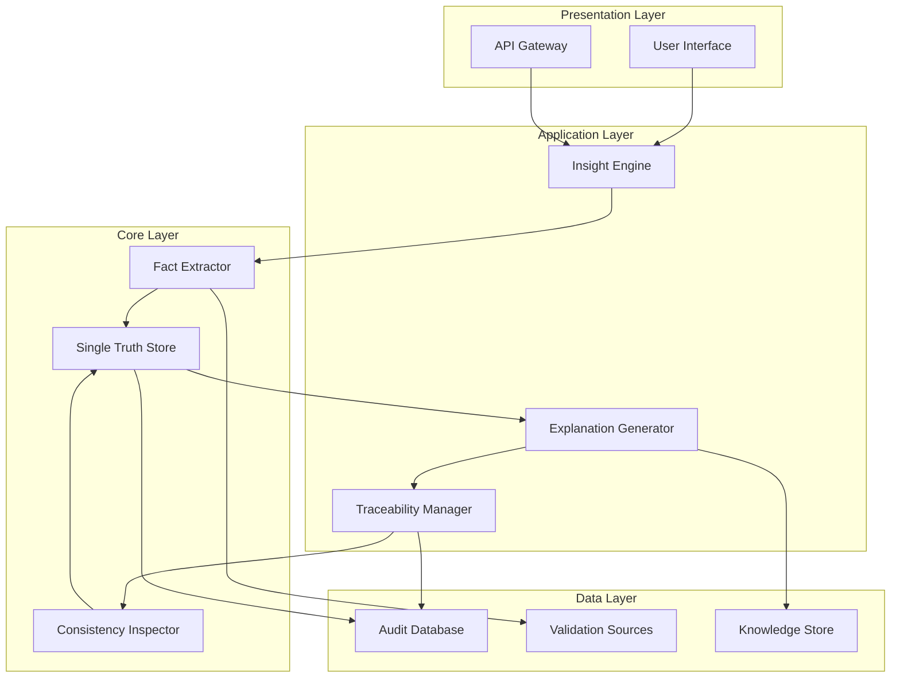

# Design Document: ExplainabilityBridge AI

## Overview

ExplainabilityBridge AI is an enterprise system designed to maintain factual consistency while translating business insights across organizational roles. The system addresses the critical problem of insight degradation during cross-role communication by establishing a single source of truth and generating role-appropriate explanations that preserve factual integrity.

The system follows a strict separation between fact extraction, truth preservation, and explanation generation. It does not make decisions, recommendations, or predictions—it exclusively focuses on explainability and consistent communication of existing insights.

Key design principles:
- **Single Source of Truth**: All explanations derive from one immutable canonical representation
- **Strict Factual Consistency**: No addition, modification, or interpretation of facts
- **Role-Appropriate Communication**: Explanations vary in abstraction and focus while maintaining identical factual content
- **Complete Traceability**: Every statement in any explanation can be traced back to its source
- **Governance and Auditability**: All processing steps are logged and reproducible

## Architecture

The system employs a layered architecture with clear separation of concerns:



### Component Responsibilities

**Insight Engine**: Orchestrates the complete processing pipeline from insight intake through explanation delivery. Manages user sessions and coordinates between all system components.

**Fact Extractor**: Parses natural language business insights to identify and categorize facts, assumptions, and constraints. Validates facts against available data sources and maintains strict separation between verified and unverified information.

**Single Truth Store**: Maintains the immutable canonical representation of each processed insight. Stores facts, assumptions, constraints, and their relationships in a structured format that enables consistent retrieval and reference.

**Explanation Generator**: Creates role-specific explanations by selecting appropriate facts, assumptions, and constraints from the canonical truth and presenting them with role-appropriate language and abstraction levels.

**Consistency Inspector**: Validates that all generated explanations maintain factual consistency with the canonical truth. Prevents any explanation from adding facts, changing numbers, or introducing bias.

**Traceability Manager**: Maintains bidirectional links between every statement in role-specific explanations and their source elements in the canonical truth. Enables audit trails and supports drill-down capabilities.

## Components and Interfaces

### Insight Processing Interface

The system accepts business insights through multiple channels:
- **Web Interface**: Direct text input with validation and preview capabilities
- **API Endpoint**: RESTful interface for programmatic integration
- **Document Upload**: Support for structured business reports and analysis documents

Input validation ensures insights contain sufficient factual content for meaningful extraction and explanation generation.

### Fact Extraction Component

The Fact Extractor employs natural language processing techniques to decompose insights into structured elements:

**Fact Identification**: Recognizes quantitative statements, measurable claims, and verifiable assertions. Each fact is tagged with confidence levels and validation status.

**Assumption Detection**: Identifies underlying beliefs, conditions, or premises that influence interpretation. Assumptions are explicitly labeled and preserved with their original context.

**Constraint Recognition**: Extracts limitations, boundary conditions, and applicability restrictions that affect the insight's scope.

**Validation Integration**: Cross-references extracted facts with available data sources to verify accuracy and flag discrepancies.

### Single Truth Store

The canonical truth representation uses a structured format that preserves:
- **Original Context**: Complete preservation of the source insight
- **Extracted Elements**: Facts, assumptions, and constraints with their relationships
- **Validation Status**: Verification results and confidence indicators
- **Immutability**: Version control and change tracking for audit purposes

### Role-Specific Explanation Engine

The Explanation Generator maintains role profiles that define:

**Analyst Profile**: Emphasizes analytical depth, statistical significance, underlying drivers, and methodological assumptions. Includes technical details and data quality indicators.

**Manager Profile**: Focuses on operational implications, resource requirements, timeline considerations, and trade-off analysis. Presents actionable context without technical complexity.

**Executive Profile**: Provides strategic framing, risk assessment, competitive implications, and business impact. Emphasizes high-level patterns and organizational consequences.

Each profile specifies vocabulary preferences, abstraction levels, and information priorities while maintaining identical factual content.

## Data Models

### Canonical Truth Model

```
CanonicalTruth {
  id: UUID
  originalInsight: String
  timestamp: DateTime
  submittedBy: UserID
  
  facts: List<Fact>
  assumptions: List<Assumption>  
  constraints: List<Constraint>
  relationships: List<Relationship>
  
  validationStatus: ValidationResult
  immutableHash: String
}

Fact {
  id: UUID
  statement: String
  category: FactCategory
  numericValue: Number (optional)
  unit: String (optional)
  validationSource: String (optional)
  confidenceLevel: Float
}

Assumption {
  id: UUID
  statement: String
  category: AssumptionCategory
  scope: String
  reliability: AssumptionReliability
}

Constraint {
  id: UUID
  statement: String
  type: ConstraintType
  applicabilityScope: String
  severity: ConstraintSeverity
}
```

### Explanation Model

```
RoleExplanation {
  id: UUID
  canonicalTruthId: UUID
  targetRole: Role
  generatedAt: DateTime
  
  content: ExplanationContent
  traceabilityMap: Map<StatementID, List<ElementID>>
  
  validationResult: ConsistencyCheck
}

ExplanationContent {
  summary: String
  keyPoints: List<String>
  detailedAnalysis: String
  assumptions: List<String>
  limitations: List<String>
}
```

### Audit Model

```
AuditRecord {
  id: UUID
  timestamp: DateTime
  userId: UserID
  action: AuditAction
  
  inputData: String
  outputData: String
  processingSteps: List<ProcessingStep>
  
  validationResults: List<ValidationResult>
  traceabilityData: TraceabilityRecord
}
```

## Data Flow

The system processes insights through a strictly controlled pipeline:

### 1. Insight Intake
- User submits business insight through interface
- System validates input format and content sufficiency
- Initial audit record created with user identification and timestamp

### 2. Fact Extraction Pipeline
- Natural language processing identifies factual statements
- Numerical values and measurements extracted with units
- Assumptions and constraints categorized and labeled
- External validation attempted where data sources available

### 3. Canonical Truth Creation
- Extracted elements structured into immutable representation
- Relationships between facts, assumptions, and constraints established
- Validation results integrated and confidence levels assigned
- Cryptographic hash generated for integrity verification

### 4. Explanation Generation
- Role-specific profiles applied to select relevant elements
- Language and abstraction appropriate for target role
- Consistency validation ensures no fact modification or addition
- Traceability links established for every generated statement

### 5. Delivery and Audit
- Role-specific explanations delivered through appropriate channels
- Complete audit trail recorded including all processing steps
- Traceability data stored for future reference and drill-down
- System maintains capability for explanation regeneration

## Error Handling

The system implements comprehensive error handling across all processing stages:

**Input Validation Errors**: Insufficient factual content, ambiguous statements, or unsupported formats result in user feedback with specific improvement guidance.

**Extraction Failures**: When fact extraction cannot achieve sufficient confidence, the system requests clarification rather than proceeding with uncertain interpretations.

**Validation Conflicts**: Discrepancies between extracted facts and validation sources are flagged and presented to users for resolution.

**Consistency Violations**: Any attempt by the explanation generator to modify facts or add new information triggers automatic rejection and system alert.

**System Failures**: All processing steps are designed for graceful degradation with complete audit trails maintained even during partial failures.

## Testing Strategy

The system requires comprehensive testing across multiple dimensions:

**Unit Testing**: Individual components tested for correct fact extraction, assumption identification, and explanation generation. Focus on edge cases including ambiguous language, conflicting information, and boundary conditions.

**Property-Based Testing**: Universal properties validated across all inputs to ensure factual consistency, traceability completeness, and role-appropriate explanation generation. Minimum 100 iterations per property test with comprehensive input generation.

**Integration Testing**: End-to-end workflows tested to verify that insights maintain consistency from intake through final explanation delivery. Cross-role explanation comparison validates identical factual content.

**Audit Testing**: Complete traceability verified through random sampling of explanations traced back to source facts. Audit trail completeness and reproducibility validated.

**User Acceptance Testing**: Role-specific explanations evaluated by target users for appropriateness, clarity, and utility while maintaining factual accuracy.

The testing approach emphasizes both specific examples and universal properties, with property-based tests handling comprehensive input coverage and unit tests focusing on concrete scenarios and error conditions.

## Correctness Properties

*A property is a characteristic or behavior that should hold true across all valid executions of a system—essentially, a formal statement about what the system should do. Properties serve as the bridge between human-readable specifications and machine-verifiable correctness guarantees.*

### Property 1: Fact Extraction Completeness
*For any* business insight containing facts, assumptions, and constraints, the system should extract and categorize all identifiable elements into the appropriate categories
**Validates: Requirements 1.1, 1.3, 1.4**

### Property 2: Canonical Truth Uniqueness
*For any* processed business insight, the system should create exactly one immutable canonical truth containing all extracted elements
**Validates: Requirements 1.5**

### Property 3: Fact Validation Consistency
*For any* extracted fact with available validation sources, the system should attempt validation and record the results consistently
**Validates: Requirements 1.2**

### Property 4: Role-Appropriate Content Generation
*For any* canonical truth and target role, the generated explanation should contain content appropriate for that role (analytical depth for analysts, operational focus for managers, strategic framing for executives)
**Validates: Requirements 2.1, 2.2, 2.3**

### Property 5: Cross-Role Traceability Consistency
*For any* set of role-specific explanations generated from the same canonical truth, all explanations should trace back to identical source facts
**Validates: Requirements 2.4**

### Property 6: Factual Consistency Preservation
*For any* role-specific explanation, all facts should be identical to those in the canonical truth with no additions, modifications, or numerical changes
**Validates: Requirements 3.1, 3.2, 3.5**

### Property 7: System Boundary Enforcement
*For any* generated explanation, the content should contain no recommendations, decisions, prioritizations, or action suggestions
**Validates: Requirements 6.1, 6.2, 6.4**

### Property 8: Assumption Handling Consistency
*For any* assumption in the canonical truth, it should be clearly labeled as an assumption, maintain consistent representation across all role explanations, and be distinguished from verified facts
**Validates: Requirements 4.1, 4.2, 4.5**

### Property 9: Complete Statement Traceability
*For any* statement in any role-specific explanation, it should be traceable back to its source element in the canonical truth
**Validates: Requirements 4.3, 5.4**

### Property 10: Assumption Update Propagation
*For any* updated assumption in a canonical truth, all previously generated explanations should reflect the change consistently when regenerated
**Validates: Requirements 4.4**

### Property 11: Multi-Role View Consistency
*For any* canonical truth viewed by multiple roles simultaneously, the unified view should show identical facts across all role perspectives
**Validates: Requirements 5.1**

### Property 12: Drill-Down Capability
*For any* role-specific explanation, drill-down functionality should provide access to the underlying canonical truth
**Validates: Requirements 5.2**

### Property 13: Explanation Comparison Support
*For any* set of role-specific explanations from the same canonical truth, the system should support comparison functionality to identify differences in presentation
**Validates: Requirements 5.3**

### Property 14: Comprehensive Audit Trail
*For any* insight processing activity, complete audit logs should be created with timestamps, user identification, processing steps, and element usage records
**Validates: Requirements 7.1, 7.3, 7.4**

### Property 15: Version History Maintenance
*For any* canonical truth, complete version history should be maintained for both the truth itself and all associated explanations
**Validates: Requirements 7.2**

### Property 16: Processing Reproducibility
*For any* business insight, reprocessing should produce identical canonical truth and explanation results
**Validates: Requirements 7.5**

### Property 17: Role-Appropriate Interface Formatting
*For any* role accessing explanations, the presentation format should be appropriate for that role's operational context (detailed for analysts, summary-focused for executives)
**Validates: Requirements 8.2, 8.3**

### Property 18: Insight Parsing Round-Trip
*For any* valid business insight, extracting elements and then reconstructing the insight should preserve all essential factual content
**Validates: Requirements 1.1**

### Property 19: Cross-Role Factual Invariance
*For any* numerical value or measurement in the original insight, that exact value should appear unchanged in all role-specific explanations
**Validates: Requirements 2.5, 3.2**

### Property 20: Assumption Context Preservation
*For any* assumption extracted from a business insight, its original context and scope should be preserved in the canonical truth and all explanations
**Validates: Requirements 1.3**